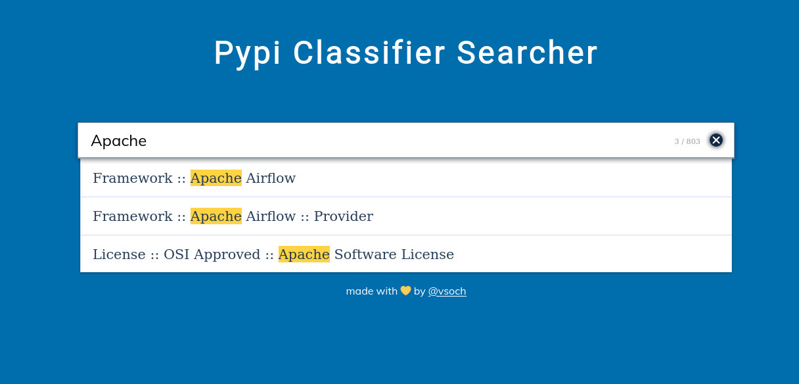

# Pypi Classifiers

I wanted an easy way to search across PyPi classifiers!

For some reason, it always takes me a really long time to find [this page](https://pypi.org/classifiers/)
and then I still need to Control+F to search it. I really just wanted a stupid list to
search so I threw together this page. It uses automation to update the classifiers
once a week from [pypa/trove-classifiers](https://github.com/pypa/trove-classifiers)
that seems to provide a programatically accessible listing that is up to date!
The data is downloaded and stored in [data/classifiers.json](data/classifiers.json).

## Why should I care?

Classifiers (and metadata in general) is really important for software. I haven't
been good about updating my classifiers because it's (historically) been really
hard to find the list. So I put together this searchable list on a whim hoping
to help future me. If it helps you too, this would be great!

Classify away, friends.
